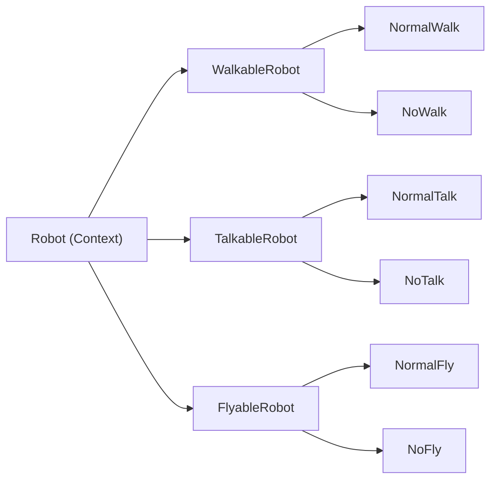

# Strategy Design Pattern — Problem, Solution, and Significance

## The core problem

In many systems, an object must do **the same kind of action in different ways** depending on context.

Examples:
- A robot can **walk** normally, or not at all
- A payment service can charge via **card**, **UPI**, or **wallet**
- A map app can **route** by fastest, shortest, or cheapest path

### Without Strategy (the bad approach)

You usually end up with one of these:

**1. Giant `if/else` or `switch` inside one class**

```python
def walk(self):
    if self.type == "companion":
        print("Walking normally...")
    elif self.type == "worker":
        print("Cannot walk.")
    # ... more types later
```

**2. Explosion of subclasses**

To cover every combination of behaviors, you need many classes:
- `WalkingTalkingRobot`
- `FlyingSilentRobot`
- `WalkingFlyingWorkerRobot`
- ...

That grows combinatorially and becomes hard to maintain.

**3. Tight coupling**

The `Robot` class knows **how** each behavior is implemented. Change one behavior → you may have to edit `Robot` itself. That breaks the **Open/Closed Principle** (open for extension, closed for modification).

---

## What Strategy solves

The **Strategy pattern** says:

> Extract each algorithm/behavior into its own class, and let the main object **delegate** to it instead of implementing the logic itself.



Your code follows this structure:

```58:77:c:\Users\DELL\Documents\GitHub\System_design\Design_principle\Strategy_design_pattern\StrategyDesignPattern.py
# --- Robot Base Class ---
class Robot(ABC):
    def __init__(
        self,
        walk_behavior: WalkableRobot,
        talk_behavior: TalkableRobot,
        fly_behavior: FlyableRobot,
    ) -> None:
        self.walk_behavior = walk_behavior
        self.talk_behavior = talk_behavior
        self.fly_behavior = fly_behavior

    def walk(self) -> None:
        self.walk_behavior.walk()

    def talk(self) -> None:
        self.talk_behavior.talk()

    def fly(self) -> None:
        self.fly_behavior.fly()
```

`Robot` does not decide *how* to walk/talk/fly. It only calls the injected strategy.

---

## How your example demonstrates it

```96:108:c:\Users\DELL\Documents\GitHub\System_design\Design_principle\Strategy_design_pattern\StrategyDesignPattern.py
if __name__ == "__main__":
    robot1 = CompanionRobot(NormalWalk(), NormalTalk(), NoFly())
    robot1.walk()
    robot1.talk()
    robot1.fly()
    robot1.projection()

    print("-"*50)

    robot2 = WorkerRobot(NoWalk(), NoTalk(), NormalFly())
    robot2.walk()
    robot2.talk()
    robot2.fly()
    robot2.projection()
```

| Robot | Walk | Talk | Fly |
|-------|------|------|-----|
| `CompanionRobot` | Normal | Normal | No |
| `WorkerRobot` | No | No | Normal |

Same `Robot` API, different behavior — chosen at **construction time** by plugging in strategies.

You avoid:
- `CompanionRobot` and `WorkerRobot` each reimplementing walk/talk/fly
- A single `Robot` class full of conditionals

`CompanionRobot` vs `WorkerRobot` only differ in `projection()` — their **identity**, not every behavior.

---

## Significance in system design

### 1. Separation of concerns
- **Context** (`Robot`) = *when* to invoke behavior  
- **Strategy** (`NormalWalk`, `NoFly`) = *how* it’s done  

### 2. Open/Closed Principle
Add `CrawlWalk` or `WhisperTalk` without changing `Robot`:

```python
robot3 = WorkerRobot(CrawlWalk(), WhisperTalk(), NormalFly())
```

### 3. Runtime flexibility
Behaviors can be swapped at runtime:

```python
robot.walk_behavior = NormalWalk()  # upgrade a broken robot
```

Useful for feature flags, A/B tests, or user preferences.

### 4. Testability
Test `NormalWalk` alone, mock strategies in `Robot` tests, test combinations independently.

### 5. Composition over inheritance
Behaviors are **composed** (injected), not inherited. That scales better than subclass trees.

---

## Real-world system design examples

| Domain | Context | Strategies |
|--------|---------|------------|
| Payments | `PaymentService` | CreditCard, UPI, PayPal |
| Caching | `CacheManager` | LRU, LFU, TTL |
| Routing | `Router` | Fastest, Cheapest, Eco |
| Auth | `AuthService` | JWT, OAuth, API Key |
| Notifications | `Notifier` | Email, SMS, Push |
| Pricing | `PricingEngine` | Flat, Tiered, Dynamic |

In a distributed system, Strategy often appears as:
- **Pluggable middleware** (different rate-limit algorithms)
- **Load balancer policies** (round-robin vs least-connections)
- **Retry/backoff policies** (linear vs exponential)

---

## Strategy vs similar patterns

| Pattern | Focus |
|---------|--------|
| **Strategy** | Swap *how* an algorithm runs |
| **State** | Object behavior changes with *internal state* |
| **Template Method** | Skeleton in base class; subclasses override steps |
| **Factory** | *Creates* objects; Strategy defines *behavior* |

Strategy and Factory are often used together: a factory picks which strategy to inject.

---

## One-line summary

**The issue:** One class tries to handle many variants of the same behavior via conditionals or subclass explosion.

**The fix:** Encapsulate each variant as a strategy and inject it into the context.

**Why it matters in system design:** You get flexible, testable, extensible systems where behavior can change without rewriting core logic — which is essential as requirements and scale grow.

If you want, I can walk through how this same idea maps to payment routing or caching in a production microservice next.