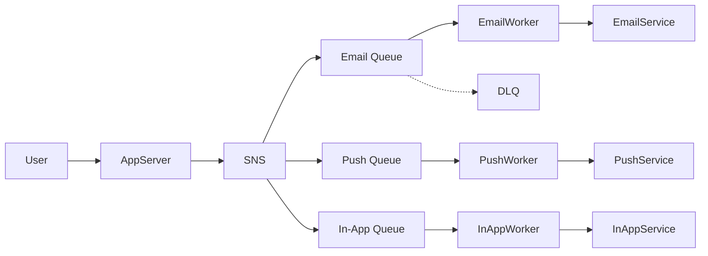

## What the code maps to (your diagram)

| Real system          | Code class                                    | Role                                             |
| -------------------- | --------------------------------------------- | ------------------------------------------------ |
| App Server           | `AppServer`                                   | Receives user action, returns fast               |
| SNS                  | `EventDispatcher`                             | Fan-out: one event → multiple channels           |
| SQS                  | `MessageQueue`                                | Buffers work per channel (email / push / in-app) |
| DLQ                  | `email_dlq`                                   | Failed messages after max retries                |
| EC2 Workers          | `NotificationWorker`                          | Background threads that poll queues              |
| Mail / Push / In-app | `EmailService`, `PushService`, `InAppService` | Third-party providers (mocked with `print`)      |

## Event → channel rules (from your diagram)

```
user signup / login     →  Email only
user post               →  Push only
friend request          →  In-app + Push  (fan-out to 2 queues)
```

## How to explain in interview (3 sentences)

1. **User hits API** → `AppServer` publishes an event to **SNS** and returns `200 OK` immediately (no waiting for email/push).
2. **SNS fans out** the event to the right **SQS queues** based on event type.
3. **Workers** pull from queues asynchronously and call the delivery provider; if sending fails, message is **retried** or moved to **DLQ**.

## What we intentionally skipped

Load balancer, auto-scaling, EC2, Kafka — mention these as **production infra**, not core notification logic. The important part is: **async + decoupling + fan-out + queues**.

## Architecture flow



## If interviewer asks “how would you scale?”

The file ends with a cheat sheet covering:

- Multiple workers per queue
- Idempotency keys (no duplicate notifications)
- User preferences (opt-out)
- Rate limiting per provider

That’s enough for a fresher-level system design answer without over-engineering the code.
